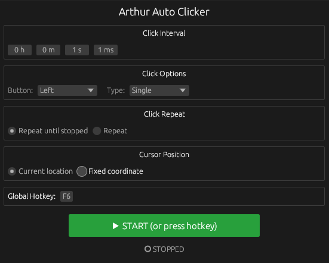

# Arthur Clicker

<p align="center">
  
</p>

<p align="center">
  <strong>A lightning-fast, modern, and simple desktop auto-clicker.</strong><br>
  Built with Rust for cross-platform reliability, low memory usage, and near-zero CPU footprint.
</p>

<p align="center">
  
</p>

---

## ✨ Why Arthur Clicker?

Arthur Clicker is designed to give you effortless mouse automation without clutter, intrusive ads, or complex setups. Whether you are automating repetitive tasks, testing UI workflows, or gaming, Arthur Clicker stays lightweight and ready in the background.

- ⏱ **Precise Timing**: Set delays down to the exact millisecond, second, minute, or hour.
- 🖱 **Flexible Clicks**: Choose Left, Middle, or Right clicks with Single, Double, or Triple tap options.
- 🎯 **Pinpoint Location**: Click wherever your cursor is, or pick a fixed coordinate on screen with an automatic 3-second countdown helper.
- 🔁 **Custom Limits**: Repeat indefinitely or stop automatically after a specific number of clicks.
- ⌨️ **Global Hotkey**: Press `F6` (or customize your own shortcut) to start and stop anytime—even while in full-screen games or other apps.
- 💾 **Remember Your Settings**: Your preferences are saved automatically so everything is right where you left it next time.

---

## 🚀 Quick Start

### 1. Download & Run
Grab the latest release for your platform or build it yourself:

```bash
# Clone the repository
git clone https://github.com/your-username/arthur_clicker.git
cd arthur_clicker

# Run the app
cargo run --release
```

### 2. How to Use
1. **Set your interval**: Enter hours, minutes, seconds, or milliseconds between clicks.
2. **Choose your button & click style**: Left/Right/Middle, Single/Double/Triple.
3. **Choose where to click**: Leave on **Current location** or click **Fixed coordinate** and use **📍 Pick in 3s** to hover over your target.
4. **Hit Start** or press **`F6`** on your keyboard to start clicking. Press **`F6`** again to stop!

---

## 🛠 For Developers: Building & Compiling

### Build Locally (macOS, Windows, Linux)
```bash
cargo build --release
```

### Cross-Compile for Windows `.exe` (from macOS or Linux)
You can easily create a standalone Windows `.exe` using `cargo-xwin`:

```bash
# One-time setup
cargo install cargo-xwin
rustup target add x86_64-pc-windows-msvc

# Build Windows release binary
cargo xwin build --release --target x86_64-pc-windows-msvc
```
The resulting executable will be in `target/x86_64-pc-windows-msvc/release/arthur_clicker.exe`.

### Running Tests
```bash
cargo test
```
